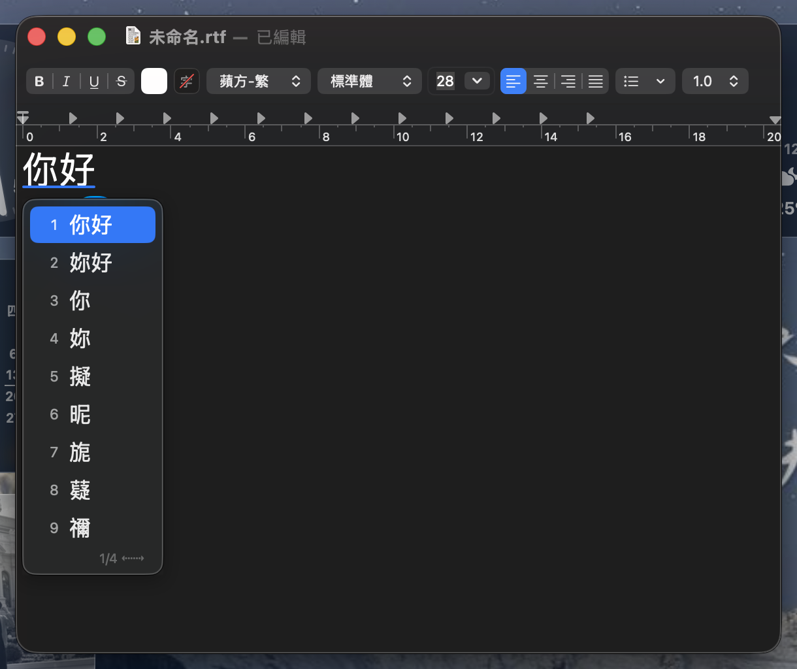
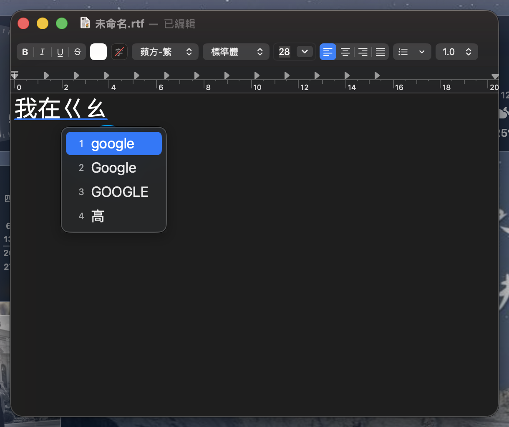
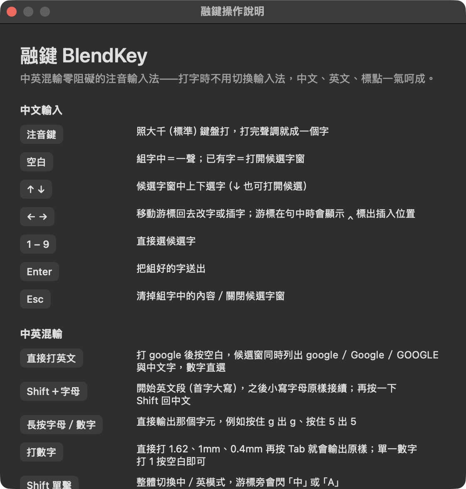
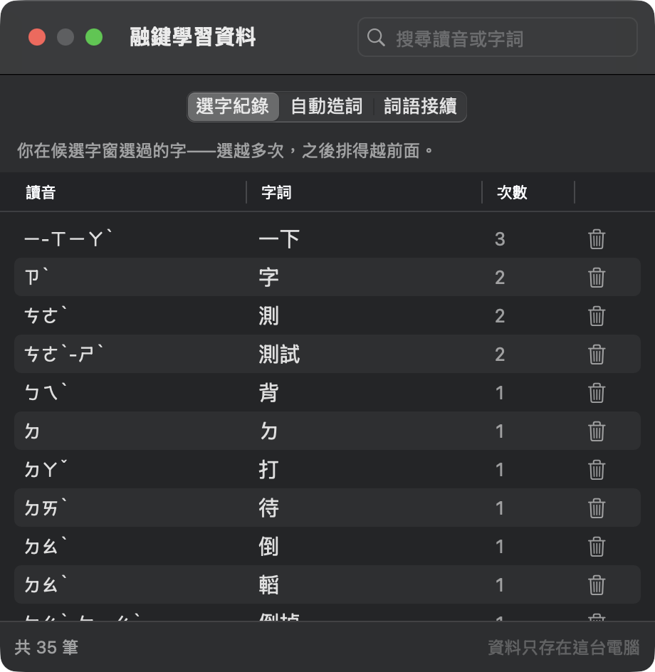

# 融鍵 BlendKey — macOS 繁體中文注音輸入法

[](https://github.com/0rigind1865-bit/BlendKey/releases/latest)
[](LICENSE)
[](#安裝一般使用者)
[](https://buymeacoffee.com/0rigind186u)

**免費開源的 macOS 注音輸入法**，主打**中英混輸零阻礙**——打中文、英文、數字、標點
不必切換輸入來源，一路打下去就好。專為經常中英夾雜的使用者設計：工程師、設計師、
在雙語環境工作的人。

```
我在google上查資料？   ← 全程沒有按過「切換輸入法」
```

<p align="center">
  
  
</p>
<p align="center">
  <sub>左：智慧整句組字與候選字窗　　右：中英並列選字——打完 google 按空白，三種大小寫與中文字一起挑</sub>
</p>

> **A free, open-source Bopomofo (Zhuyin) input method for macOS**, built for
> frictionless Chinese-English mixed typing — type Chinese, English, numbers and
> punctuation without ever switching input sources.

**支援**：macOS 14 以上 ・ 大千（標準）注音鍵盤 ・ 繁體中文 ・ 完全免費、無廣告、不連網

## 為什麼再做一個注音輸入法？

內建注音與現有的開源輸入法（小麥注音、威注音）都很成熟，但**中英夾雜**這件事一直
很痛：想打一個英文單字就得切換輸入法，切回來又常常忘記。融鍵把這件事當成唯一的
核心問題來解——打 `google` 直接在候選字裡給你 `google／Google／GOOGLE`，
忘了切回中文就自己偵測並修正回來。

## 特色

- **智慧整句組句**——連續打注音自動組詞成句（詞圖＋動態規劃），游標移回可改字，改過的字會被記住（使用者詞庫學習）
- **自動造詞**——同一串音節連續兩次被你改字後上屏（例如兩次都改出「融鍵」），自動學成使用者新詞，之後整個詞一次組出來
- **越用越準**——每次上屏都會記下「詞與詞的接續習慣」，形成專屬於你的語料。同一句話打第一次之後正確率就從 80% 升到 87%，打過三次達 96%；沒學過的句子完全不受影響（只獎勵你真的打過的組合）。學習資料只存本機 `~/Library/Application Support/BlendKey/userphrases.json`，偏好設定裡可一鍵清除
- **Shift 單擊切換中／英**——Windows 新注音使用者零學習成本；切換時游標旁閃現「中／A」提示
- **Shift＋字母直出英文＋接續段**——Shift+G 之後小寫字母原樣接續（`Google`、`iPhone15`、`test.com v2` 都一氣呵成，空白標點皆半形），再單擊 Shift／Esc 回中文組字；長按字母開頭則是小寫英文段（`google`）；按著 Shift 不放就是全大寫（`USB`）
- **英文自動偵測＋中英並列選字**——直接打 `google`，輸入法發現「這串不像注音」（命中英文詞典，或注音鍵位被反覆覆寫）跳出提示；按**空白**開並列候選 `1.google 2.Google 3.GOOGLE 4.高`（英文三種大小寫與一聲中文字同窗，數字直選），按 **Tab** 快速上小寫，按 Esc 關窗繼續打注音
- **反向偵測**——英文模式下忘了切回來就直接打注音？連續兩個乾淨音節（零覆寫、含數字聲調、詞庫查得到）就自動切回中文模式並閃現「中」提示，**已打出的字母也會自動收回、原地重組成中文**（先驗證游標前內容無誤才動手；不支援讀取的 app 退回只切模式）
- **長按直出**——按住 `5` 出數字 5、按住 `g` 出字母 g（鍵盤自動重複當訊號；聲調鍵 3/4/6/7 在空組字區本來就直接放行成數字）
- **全形標點**——`<` `>` `?` `!` `'` `[` `]` 等直接出 ，。？！、「」
- **Mac 原生質感**——直式候選清單（比照系統內建注音）、毛玻璃（NSVisualEffectView）、圓角連續曲線、跟隨游標定位

## 安裝（一般使用者）

1. 到 [Releases](https://github.com/0rigind1865-bit/BlendKey/releases) 下載最新的 `BlendKey-x.y.z.zip` 並解壓縮
2. 在「**安裝融鍵.command**」上**按右鍵 →「打開」**→ 再按一次「打開」
   （本專案沒有付費的 Apple 開發者憑證，第一次要用右鍵開啟以略過系統警告）
3. 依畫面指示**登出再登入**（macOS 限制：新輸入法必須重新登入才會出現）
4. 「系統設定 › 鍵盤 › 輸入來源 › 編輯 › ＋ › 繁體中文」加入「**融鍵**」

用法看選單列的融鍵圖示 ›「操作說明…」。

### 移除

把 `~/Library/Input Methods/BlendKey.app` 丟垃圾桶，並在系統設定的輸入來源移除「融鍵」。
學習資料在 `~/Library/Application Support/BlendKey/`。

## 安裝（從原始碼）

```bash
scripts/build-data.sh   # 首次：下載並轉換詞庫（小麥注音，MIT）
scripts/install.sh      # 建置、打包、安裝到 ~/Library/Input Methods
scripts/make-release.sh # 打包可散布的 zip（含安裝腳本）
```

首次一樣要登出再登入；之後更新重跑 `scripts/install.sh`，切個輸入框就生效。
自行建置的版本沒有隔離屬性問題，不需要右鍵開啟。

## 按鍵一覽（中文模式）

| 按鍵 | 行為 |
|------|------|
| 注音鍵（大千） | 組字，調號落下即成音節 |
| 空白 | 組字中＝一聲；有組字區＝開候選窗 |
| ↓ | 開游標右側詞的候選窗；窗內＝下一個候選 |
| ↑ | 窗內＝上一個候選 |
| ←→ | 移動游標（改字用）；窗內＝翻頁 |
| 1–9 | 選候選 |
| Caps Lock | 亮＝英數直通模式；但若在此狀態下打注音，會自動判定並切回中文 |
| Tab | 接受英文／數字偵測提示（`1.62`、`1mm`、`0.4mm` 打完按 Tab 直出；單一數字 `1` 按空白即可） |
| 長按字母／數字鍵 | 直接輸出該字元（英文字母、數字），不當注音 |
| Enter | 上屏 |
| Esc | 清組字／關候選窗 |
| Shift 單擊 | 切換中／英 |
| Shift＋字母 | 開英文接續段（首字母大寫；後續小寫原樣，空白標點半形） |
| 接續段中單擊 Shift／Esc | 結束英文段，回注音組字 |

輸入法選單（選單列的融鍵圖示）提供：**操作說明**、**學習資料**（可逐筆檢視與刪除）、**偏好設定**。

<p align="center">
  
  
</p>
<p align="center">
  <sub>左：一頁看完怎麼用　　右：融鍵記住了什麼——可搜尋、可逐筆刪掉學壞的</sub>
</p>

## 開發

```bash
swift test               # 88 個核心單元測試（組字、斷詞、混輸、學習）
swift run blendkey-cli   # REPL：不安裝也能玩整條組字管線
log stream --level debug --predicate 'subsystem == "org.blendkey.inputmethod.BlendKey"'

# 組句品質量測（90 句自然語句；--train 可模擬「使用者打過這些內容」）
swift run -c release blendkey-cli --eval Tests/Fixtures/sentences.tsv
```

架構：`BlendKeyCore`（純邏輯，零 AppKit 依賴，全部可測）＋ `BlendKey`（InputMethodKit 殼層）。
純 SwiftPM，不需要 Xcode 專案檔；`scripts/package-app.sh` 負責組 .app bundle 與簽章。

## 已知限制

- NSMenu 與開／存檔對話框中收不到 flagsChanged，Shift 切換暫時失靈（平台限制）
- 斷詞用 unigram＋長詞偏好＋使用者詞對學習；沒打過的罕見句型可能要手動改字一次
- 選單列圖示不隨中英模式變化（HUD 已涵蓋；輸入模式架構會逼出第二次登出，不划算）

## 常見問題

**融鍵和內建注音、小麥注音、威注音差在哪？**
差在中英混輸。其他輸入法要打英文得切換輸入來源；融鍵讓你直接打下去，
候選字窗同時給你英文與中文，忘了切換也會自動偵測修正。中文組字品質則同樣
使用小麥注音的開源詞庫。

**會蒐集我打的字嗎？**
不會。融鍵完全不連網，學習資料（選字習慣、自造詞、詞語接續）只存在你自己的
電腦 `~/Library/Application Support/BlendKey/`，可在偏好設定裡隨時檢視與清除。

**為什麼安裝時出現「無法打開，因為無法驗證開發者」？**
因為本專案沒有付費的 Apple 開發者憑證（年費 99 美元）。用**右鍵點安裝程式 →
「打開」**即可略過。程式碼全部開源可供檢視。

**為什麼裝完看不到「融鍵」？**
macOS 的限制：新輸入法必須登出再登入才會出現在系統設定。這是 Apple 已知的
行為（FB23026482），所有第三方輸入法都一樣。

**支援倚天、許氏鍵盤嗎？**
目前只支援大千（標準）注音鍵盤。有需求的話歡迎開 issue 讓我知道。

**支援 Windows 或 iOS 嗎？**
不支援，融鍵是 macOS 專用（使用 InputMethodKit）。

## 贊助

融鍵是免費開源、無廣告、不連網的個人專案。覺得好用的話，可以請我喝杯咖啡：

<a href="https://buymeacoffee.com/0rigind186u"></a>

也歡迎用其他方式支持：給專案一顆 ⭐、回報問題、或推薦給需要的朋友。

## 授權

程式碼 MIT。詞庫轉換自 [McBopomofo 小麥注音](https://github.com/openvanilla/McBopomofo)（MIT，見
`Resources/data/LICENSE-McBopomofo.txt`）；英文詞表使用 macOS 內建 `/usr/share/dict/words`（公有領域）。

---

<sub>關鍵字：macOS 注音輸入法、Mac 中文輸入法、繁體中文輸入法、大千鍵盤、中英混輸、
免費輸入法、開源輸入法、bopomofo input method for macOS、zhuyin IME、
traditional Chinese input method、Taiwan、注音、ㄅㄆㄇㄈ</sub>
